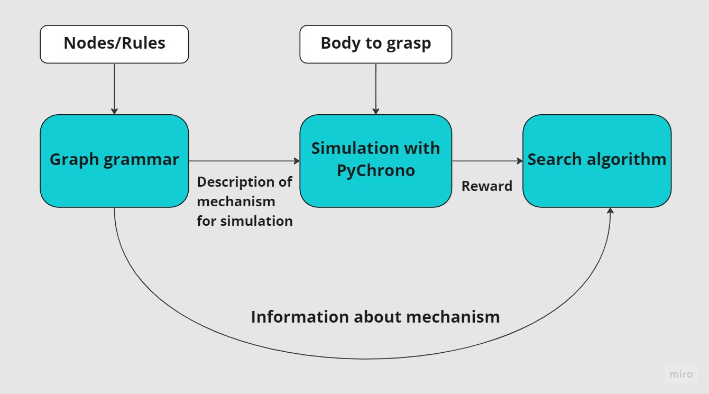
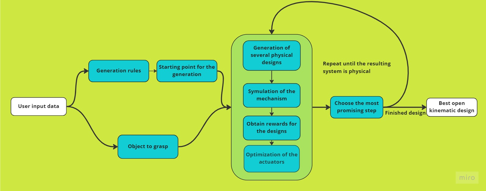
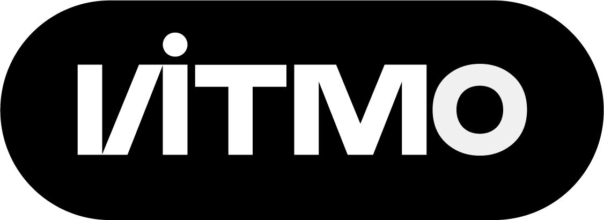

# Rostok

Rostok is an open source Python framework for generative design of linkage mechanisms for robotic purposes. It provides a framework to describe mechanisms as a graph, set an environment, perform simulation of generated mechanisms, get a reward as a quantitative value of the generated design, and search for the best possible design. 

A user can utilize the entire framework as a pipeline to generate a set of suboptimal designs, or utilize the modules and submodules as independent parts. The framework allows to implement custom generative rules, modify search and optimization algorithms. 

Currently the framework allows to perform co-design of open chain linkage mechanisms. Co-design consists in simultaneously searching for the mechanical structure and the trajectories of the robot to get the best possible performance. 

## Project desription

There are four main blocks:  

* Graph Grammar -- is needed for creation, modification, and extraction of the data from the graphs that contain the entire information of generated mechanisms
* Virtual Experiment -- is the simulation needed for quantitative analysis of the behavior  and performance of generated mechanisms specified by grammar graphs
* Trajectory Optimization -- finds suboptimal joint trajectories needed to efficiently perform the desired motion
* Search Algorithm -- looks for optimal graph to represent mechanism topology

More detailed description of the [algorithms and methods](docs/Algorithm.md). 

## Prerequisites

* Anaconda3 
* Usage of the Docker reqires installation of Х-server for Windows https://sourceforge.net/projects/vcxsrv/

## Installation in development mode 

Rostok library is a framework that allows user to tune it for solving various task. Therefore, in order to get the full potential of the library a user should install it in development mode:  

* Create the environment using `conda env create -f environment.yml`
* activate the environment `rostok`  
* Install the lates version of PyChrono physical engine using `conda install -c projectchrono pychrono`  
* Install the package in development mode `pip3 install -e .`  

### Known issues 

At some computers one can see a problem with the tcl module `version conflict for package "Tcl": have 8.6.12, need exactly 8.6.10`, try to install tk 8.6.10 using `conda install tk=8.6.10`

After the installation of the package one can get an error `Original error was: DLL load failed while importing _multiarray_umath: The specified module could not be found` , try to reinstall numpy in the rostok environment

## Documentation

The description of the project and tutorials are available [at project websitehere](https://licaibeerlab.github.io/graph_assembler/).

## Publications

* I. I. Borisov, E. E. Khornutov, D. V. Ivolga, N. A. Molchanov, I. A. Maksimov and S. A. Kolyubin, "Reconfigurable Underactuated Adaptive Gripper Designed by Morphological Computation," 2022 International Conference on Robotics and Automation (ICRA), 2022, pp. 1130-1136, doi: 10.1109/ICRA46639.2022.9811738.

## Examples

The example of configuration and using the generative pipeline is in `rostok\app` directory.  
The examples of usage of individual modules is in `rostok\examples` directory. 

## Acknowledgments

### Affiliation

The library was developed in [ITMO University](https://en.itmo.ru/).

### Developers

* Ivan Borisov - chief scientist 
* Kirill Zharkov - team leader
* Yefim Osipov
* Dmitriy Ivolga
* Kirill Nasonov
* Mikhail Chaikovskii

## Contacts

* Ivan Borisov borisovii@itmo.ru for scientific aspects of the project
* Kirill Zharkov kzharkov@itmo.ru for technical questions