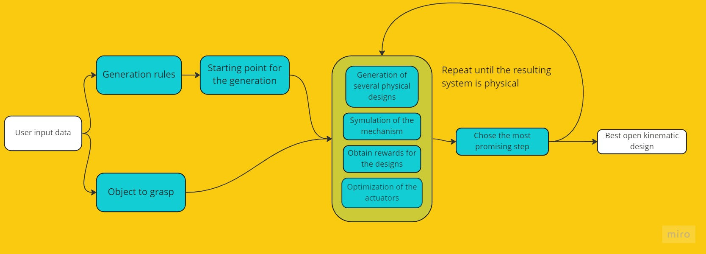

===================
Project description
===================

Our goal is to shift the generative design from static details to the domain of the dynamic systems.
Currently, the library contains the algorithm that searches for the grasping mechanism with open kinematic chain.

Project Structure
-----------------

There are three main blocks

* Graph grammar - build, modification and get information from the graphs that contains full information of the mechanism
* Virtual experiment - simulate the mechanism specified by the graph and get the reward for the attempt to grasp the body
* Search algorithm - traverse the space of the possible designs in order to achieve the better reward

.. image:: ../images/general_scheme.jpg
